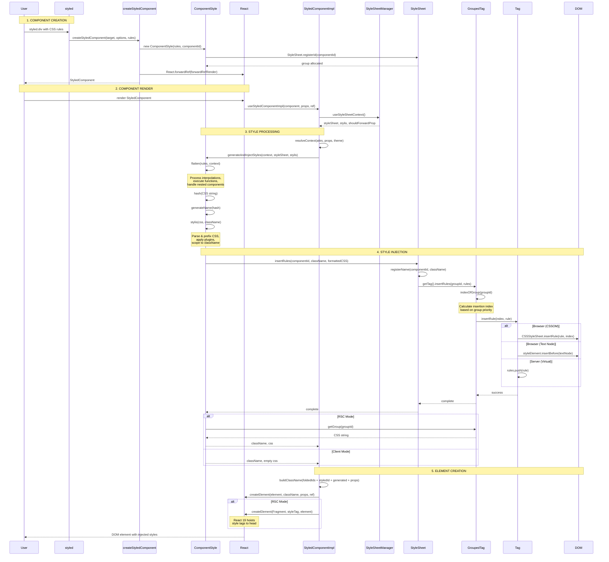

use pnpm package manager and associated commands
never run the dev server yourself, ask the user to start it if needed
use conventional commits: (feat|fix|chore|refactor|test|docs|style|perf|build|ci): [description]

styled-components - CSS-in-JS library for React with tagged template literals

Mandates

- React 16.8 compat
- Always microbenchmark to validate optimizations
- Optimize for low memory pressure and monomorphic functions

Agent rules

- Create changesets for public-facing changes
- Do not edit the CHANGELOG.md file, it is auto-generated by changesets

Root Level

- `package.json` - Monorepo config with pnpm workspaces
- `README.md` - Main project documentation
- `CONTRIBUTING.md` - Setup guide and contribution guidelines
- `babel-preset.js`, `babel.config.js` - Shared Babel configuration

Packages

`packages/styled-components/src` - Main Library

- `base.ts` - Shared exports (warnings, utilities)
- `constants.ts` - Library constants (SC_ATTR, SC_VERSION)
- `constructors/constructWithOptions.ts` - Factory for custom configs
- `constructors/createGlobalStyle.ts` - Global styles API
- `constructors/css.ts` - css template literal helper
- `constructors/keyframes.ts` - Animation keyframes API
- `constructors/styled.tsx` - Main styled() API
- `hoc/withTheme.tsx` - Theme HOC
- `index.ts` - Main entry point, exports all public APIs
- `models/ComponentStyle.ts` - Style compilation & injection
- `models/GlobalStyle.ts` - Global style model
- `models/InlineStyle.ts` - Native inline styles
- `models/Keyframes.ts` - Keyframe animation model
- `models/ServerStyleSheet.tsx` - SSR style collection
- `models/StyledComponent.ts` - Core styled component class
- `models/StyleSheetManager.tsx` - Style sheet configuration
- `models/ThemeProvider.tsx` - Theming context & hooks
- `native/index.ts` - React Native entry point
- `sheet/dom.ts` - DOM-specific sheet operations
- `sheet/GroupedTag.ts` - Grouped tag optimization
- `sheet/GroupIDAllocator.ts` - Component ID allocation
- `sheet/Rehydration.ts` - SSR hydration logic
- `sheet/Sheet.ts` - Style sheet abstraction
- `sheet/Tag.ts` - DOM style tag manipulation
- `types.ts` - TypeScript type definitions
- `utils/flatten.ts` - Style processing
- `utils/interleave.ts` - Style processing
- `utils/stylis.ts` - Style processing

`packages/sandbox/` - Next.js Test Environment

Structure

- `app/` - Next.js App Router
  - `layout.tsx` - Root layout with registry
  - `page.tsx` - Server component example
  - `client-example/page.tsx` - Client component example
  - `lib/registry.tsx` - StyledComponentsRegistry for RSC

`packages/benchmarks/` - Performance Testing

Performance benchmarks comparing CSS-in-JS libraries

- `src/implementations/` - Different library implementations
  - `styled-components` (v5, v6, object syntax)
  - `emotion`, `goober`, `aphrodite`, `styletron`, etc.
- `src/cases/` - Benchmark test cases (SierpinskiTriangle, Tree)
- `src/app/` - Benchmark UI components

- `src/utils/errors.md` - Error code documentation

Key Commands

- `pnpm build` - Build main package
- `pnpm test` - Run all tests
- `pnpm --filter sandbox dev` - Start Next.js dev server
- `pnpm --filter styled-components test:web` - Test web build
- `pnpm --filter styled-components test:native` - Test React Native

Rendering Flow - Update this diagram as the library is edited.

