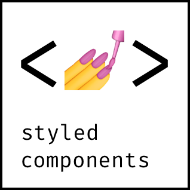

<a href="https://github.com/styled-components/styled-components">
  
</a>
<br />

Visual primitives for the component age. Use the best bits of ES6 and CSS to style your apps without stress 💅

```
npm install --save styled-components
```

[](https://travis-ci.org/styled-components/styled-components) [](https://ci.appveyor.com/project/mxstbr/styled-components) [](http://thinkmill.com.au/?utm_source=github&utm_medium=badge&utm_campaign=styled-components)

Utilising [tagged template literals](./docs/tagged-template-literals.md) (a recent addition to JavaScript) and the [power of CSS](./docs/css-we-support.md), `styled-components` allows you to write actual CSS code to style your components. It also removes the mapping between components and styles – using components as a low-level styling construct could not be easier!

`styled-components` is compatible with both React (for web) and ReactNative – meaning it's the perfect choice even for truly universal apps! See the [ReactNative section](#react-native) for more information

> **Note:** If you're not using `npm` as your package manager, aren't using a module bundler or aren't sure about either of those jump to [Alternative Installation Methods](#alternative-installation-methods).

## Usage

### Basic

This creates two react components, `<Title>` and `<Wrapper>`:

```JSX
import React from 'react';

import styled from 'styled-components';

// Create a <Title> react component that renders an <h1> which is
// centered, palevioletred and sized at 1.5em
const Title = styled.h1`
  font-size: 1.5em;
  text-align: center;
  color: palevioletred;
`;

// Create a <Wrapper> react component that renders a <section> with
// some padding and a papayawhip background
const Wrapper = styled.section`
  padding: 4em;
  background: papayawhip;
`;
```

*(The CSS rules are automatically vendor prefixed, so you don't have to think about it!)*

You render them like so:

```JSX
// Use them like any other React component – except they're styled!
<Wrapper>
  <Title>Hello World, this is my first styled component!</Title>
</Wrapper>
```

<div align="center">
  <a href="http://www.webpackbin.com/VkbO4mdR-">
    
    <div><em>Live demo</em></div>
  </a>
</div>

### Passed props

Styled components pass on all their props. This is a styled `<input>`:

```JS
import React from 'react';
import styled from 'styled-components';

// Create an <Input> component that'll render an <input> tag with some styles
const Input = styled.input`
  font-size: 1.25em;
  padding: 0.5em;
  margin: 0.5em;
  color: palevioletred;
  background: papayawhip;
  border: none;
  border-radius: 3px;

  &:hover {
    box-shadow: inset 1px 1px 2px rgba(0,0,0,0.1);
  }
`;
```

You can just pass a `placeholder` prop into the `styled-component`. It will pass it on to the DOM node like any other react component:

```JSX
// Render a styled input with a placeholder of "@mxstbr"
<Input placeholder="@mxstbr" type="text" />
```

Here is one input without any content showing the placeholder, and one with some content:

<div align="center">
  <a href="http://www.webpackbin.com/VJSbrmOA-">
    
    <div><em>Live demo</em></div>
  </a>
</div>

### Adapting based on props

This is a button component that has a `primary` state. By setting `primary` to `true` when rendering it we adjust the background and text color. *(see [tips and tricks](./docs/tips-and-tricks.md#component-adjustments) for more examples of this pattern!)*

```JSX
import styled from 'styled-components';

const Button = styled.button`
  /* Adapt the colors based on primary prop */
  background: ${props => props.primary ? 'palevioletred' : 'white'};
  color: ${props => props.primary ? 'white' : 'palevioletred'};

  font-size: 1em;
  margin: 1em;
  padding: 0.25em 1em;
  border: 2px solid palevioletred;
  border-radius: 3px;
`;

export default Button;
```

```JSX
<Button>Normal</Button>
<Button primary>Primary</Button>
```

<div align="center">
  <a href="http://www.webpackbin.com/VkFaQgtA-">
    
    <div><em>Live demo</em></div>
  </a>
</div>

### Overriding component styles

Taking the `Button` component from above and removing the primary rules, this is what we're left with – just a normal button:

```JSX
import styled from 'styled-components';

const Button = styled.button`
  background: white;
  color: palevioletred;
  font-size: 1em;
  margin: 1em;
  padding: 0.25em 1em;
  border: 2px solid palevioletred;
  border-radius: 3px;
`;

export default Button;
```

Let's say someplace else you want to use your button component, but just in this one case you want the color and border color to be `tomato` instead of `palevioletred`. Now you _could_ pass in an interpolated function and change them based on some props, but that's quite a lot of effort for overriding the styles once.

To do this in an easier way you can call `styled` as a function and pass in the previous component. You style that like any other styled-component. It overrides duplicate styles from the initial component and keeps the others around:

```JSX
// Tomatobutton.js

import React from 'react';
import styled from 'styled-components';

import Button from './Button';

const TomatoButton = styled(Button)`
  color: tomato;
  border-color: tomato;
`;

export default TomatoButton;
```

This is what our `TomatoButton` looks like, even though we have only specified the `color` and the `border-color`. Instead of copy and pasting or factoring out the styles into a separate function we've now reused them.

<div align="center">
  <a href="http://www.webpackbin.com/4yOENXOCZ">
    
    <div><em>Live demo</em></div>
  </a>
</div>

<br />

> **Note:** You can also pass tag names into the `styled()` call, like so: `styled('div')`. In fact, the styled.tagname helpers are just aliases of `styled('tagname')`!

#### Third-party components

The above also works perfectly for styling third-party components, like a `react-router` `<Link />`!

```JS
import styled from 'styled-components';
import { Link } from 'react-router';

const StyledLink = styled(Link)`
  color: palevioletred;
  display: block;
  margin: 0.5em 0;
  font-family: Helvetica, Arial, sans-serif;

  &:hover {
    text-decoration: underline;
  }
`;
```

```JSX
<Link to="/">Standard, unstyled Link</Link>
<StyledLink to="/">This Link is styled!</StyledLink>
```

<div align="center">
  <a href="http://www.webpackbin.com/NyCcBm_C-">
    
    <div><em>Live demo</em></div>
  </a>
</div>

### Animations

CSS animations with `@keyframes` aren't scoped to a single component but you still don't want them to be global. This is why we export a `keyframes` helper which will generate a unique name for your keyframes. You can then use that unique name throughout your app.

This way, you get all the benefits of using JavaScript, are avoiding name clashes and get your keyframes like always:

```JS
import styled, { keyframes } from 'styled-components';

// keyframes returns a unique name based on a hash of the contents of the keyframes
const rotate360 = keyframes`
  from {
    transform: rotate(0deg);
  }

  to {
    transform: rotate(360deg);
  }
`;

// Here we create a component that will rotate everything we pass in over two seconds
const Rotate = styled.div`
  display: inline-block;
  animation: ${rotate360} 2s linear infinite;
`;
```

This will now rotate it's children over and over again, for example our logo:

```JSX
<Rotate>&lt; 💅 &gt;</Rotate>
```

<div align="center">
  <a href="http://www.webpackbin.com/EJjD8QdCZ">
    
    <div><em>Live demo</em></div>
  </a>
</div>

### React Native

`styled-components` has a ReactNative mode that works _exactly_ the same, except you import the things from `styled-components/native`:

```JSX
import styled from 'styled-components/native';

const StyledView = styled.View`
  background-color: papayawhip;
`;

const StyledText = styled.Text`
  color: palevioletred;
`;

class MyReactNativeComponent extends React.Component {
  render() {
    <StyledView>
      <StyledText>Hello World!</StyledText>
    </StyledView>
  }
}
```

> You cannot use the `keyframes` and `injectGlobal` helpers since ReactNative doesn't support keyframes or global styles. We will also log a warning if you use media queries or nesting in your CSS.

### Theming

`styled-components` has full theming support by exporting a wrapper `<ThemeProvider>` component. This component provides a theme to all react components underneath itself in the render tree, even multiple levels deep.

To illustrate this, let's create a component that renders its children with a theme. We do so by wrapping all its children in a `ThemeProvider` that has a `theme`:

```JSX
import { ThemeProvider } from 'styled-components';

const theme = {
  main: 'mediumseagreen',
};

// Create a GreenSection component that renders its children wrapped in
// a ThemeProvider with a green theme
const GreenSection = (props) => {
  return (
    <ThemeProvider theme={theme}>
      {props.children}
    </ThemeProvider>
  );
}
```

Second, let's create a styled component that adapts to the theme.

`styled-components` injects the current theme via `props.theme` into the components, which means you can adapt your component to the theme with interpolated functions.

We'll create a `button` that adapts based on the `main` property of the theme:

```JS
// Button.js
import styled from 'styled-components';

const Button = styled.button`
  /* Color the background and border with theme.main, otherwise 'palevioletred' */
  background: ${props => props.theme.main || 'palevioletred'};
  border: 2px solid ${props => props.theme.main || 'palevioletred'};

  /* …more styles here… */
`;
```

Now, when we render the `Button` inside a `GreenSection`, it'll be green! If not, it'll be red.

```JSX
<Button>Normal Button</Button>
<GreenSection>
  {/* Notice how there's no code changes for the button, it just
      adapts to the theme passed from GreenSection! */}
  <Button>Green Button!</Button>
  <div>
    <div>
      <div>
        {/* This works unlimited levels deep within the component
            tree since we use React's context to pass the theme down. */}
        <Button>Another green button!</Button>
      </div>
    </div>
  </div>
</GreenSection>
```

<div align="center">
  <a href="http://www.webpackbin.com/4ypo8QORb">
    
    <div><em>Live demo</em></div>
  </a>
</div>

See the [theming doc](./docs/theming.md) for more detailed instructions.

## Docs

See [the documentation](./docs) for more information about using `styled-components`.

### Table of Contents

- [API Reference](./docs/api.md)
- [Tips and Tricks](./docs/tips-and-tricks.md)
- [Tagged Template Literals](./docs/tagged-template-literals.md): How do they work?
- [What CSS we support](./docs/css-we-support.md): What parts & extensions of CSS can you use within a component?
- [Theming](./docs/theming.md): How to work with themes

## Syntax highlighting

The one thing you lose when writing CSS in template literals is syntax highlighting. We're working hard on making proper syntax highlighting happening in all editors. We currently have support for Atom.

This is what it looks like when properly highlighted:


### Atom

[**@gandm**](https://github.com/gandm), the creator of `language-babel`, has added support for `styled-components` in Atom!

To get proper syntax highlighting, all you have to do is install and use the `language-babel` package for your JavaScript files!

### Other Editors

We could use your help to get syntax highlighting support to other editors! If you want to start working on syntax highlighting for your editor, open an issue to let us know.

## Further Reading

These are some great articles and talks about related topics in case you're hungry for more:

- [📝 "Scale" FUD and Style Components](https://medium.com/learnreact/scale-fud-and-style-components-c0ce87ec9772#.kzjba8lcg): Using components as low-level styling constructs
- [🎙 The Future of Reusable CSS](https://www.youtube.com/watch?v=XR6eM_5pAb0): How component libraries should be styled, and why they're not yet
- [📝 Rendering Khan Academy’s Learn Menu Wherever I Please](https://medium.com/@jdan/rendering-khan-academys-learn-menu-wherever-i-please-4b58d4a9432d#.w9nshye05): Documenting the move from the handlebars + less combo to react and inline styles
- [🖥 Ryan's random thoughts about inline styles](https://www.youtube.com/watch?v=EkPcGS4TzdQ): Explaining some benefits of using styles in js

## Alternative Installation Methods

If you're not using a module bundler or not using `npm` as your package manager, we also have a global ("UMD") build!

You can use that via the `unpkg` CDN to get `styled-components`, the URL is `https://unpkg.com/styled-components/dist/styled-components.min.js`.

To install `styled-components` with bower you'd do:

```
bower install styled-components=https://unpkg.com/styled-components/dist/styled-components.min.js
```

To use it from your HTML, add this at the bottom of your `index.html`, and you'll have access to the global `window.styled` variable:

```HTML
<script src="https://unpkg.com/styled-components/dist/styled-components.min.js" type="text/javascript"></script>
```

## License

Licensed under the MIT License, Copyright © 2016 Glen Maddern and Maximilian Stoiber.

See [LICENSE](./LICENSE) for more information.

## Acknowledgements

This project builds on a long line of earlier work by clever folks all around the world. We'd like to thank Charlie Somerville, Nik Graf, Sunil Pai, Michael Chan, Andrey Popp, Jed Watson & Andrey Sitnik who contributed ideas, code or inspiration.

Special thanks to [@okonet](https://github.com/okonet) for the fantastic logo.

Development supported by [Front End Center](https://frontend.center) and [Thinkmill](http://thinkmill.com.au/)
