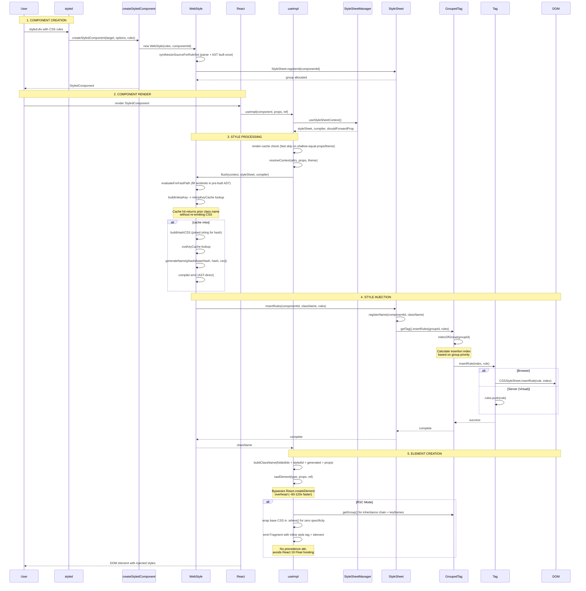

# Rendering Flow

Update this diagram as the library is edited.

```mermaid
sequenceDiagram
    participant User
    participant styled
    participant createStyledComponent
    participant WebStyle
    participant React
    participant useImpl
    participant StyleSheetManager
    participant StyleSheet
    participant GroupedTag
    participant Tag
    participant DOM

    Note over User,styled: 1. COMPONENT CREATION
    User->>styled: styled.div with CSS rules
    styled->>createStyledComponent: createStyledComponent(target, options, rules)
    createStyledComponent->>WebStyle: new WebStyle(rules, componentId)
    WebStyle->>WebStyle: synthesizeSourceForRuleSet (parse + AST built once)
    WebStyle->>StyleSheet: StyleSheet.registerId(componentId)
    StyleSheet-->>WebStyle: group allocated
    createStyledComponent-->>User: StyledComponent

    Note over User,React: 2. COMPONENT RENDER
    User->>React: render StyledComponent
    React->>useImpl: useImpl(component, props, ref)
    useImpl->>StyleSheetManager: useStyleSheetContext()
    StyleSheetManager-->>useImpl: styleSheet, compiler, shouldForwardProp

    Note over useImpl,WebStyle: 3. STYLE PROCESSING
    useImpl->>useImpl: render-cache check (fast skip on shallow-equal props/theme)
    useImpl->>useImpl: resolveContext(attrs, props, theme)
    useImpl->>WebStyle: flush(context, styleSheet, compiler)
    WebStyle->>WebStyle: evaluateForFastPath (fill sentinels in pre-built AST)
    WebStyle->>WebStyle: buildInterpKey -> interpKeyCache lookup
    Note over WebStyle: Cache hit returns prior class name<br/>without re-emitting CSS

    alt cache miss
        WebStyle->>WebStyle: buildHashCSS (joined string for hash)
        WebStyle->>WebStyle: cssKeyCache lookup
        WebStyle->>WebStyle: generateName(phash(baseHash, hash, css))
        WebStyle->>WebStyle: compiler.emit (AST-direct)
    end

    Note over WebStyle,DOM: 4. STYLE INJECTION
    WebStyle->>StyleSheet: insertRules(componentId, className, rules)
    StyleSheet->>StyleSheet: registerName(componentId, className)
    StyleSheet->>GroupedTag: getTag().insertRules(groupId, rules)
    GroupedTag->>GroupedTag: indexOfGroup(groupId)
    Note over GroupedTag: Calculate insertion index<br/>based on group priority

    GroupedTag->>Tag: insertRule(index, rule)

    alt Browser
        Tag->>DOM: CSSStyleSheet.insertRule(rule, index)
    else Server (Virtual)
        Tag->>Tag: rules.push(rule)
    end

    Tag-->>GroupedTag: success
    GroupedTag-->>StyleSheet: complete
    StyleSheet-->>WebStyle: complete

    WebStyle-->>useImpl: className

    Note over useImpl,DOM: 5. ELEMENT CREATION
    useImpl->>useImpl: buildClassName(foldedIds + styledId + generated + props)
    useImpl->>useImpl: rawElement(type, props, ref)
    Note over useImpl: Bypasses React.createElement<br/>overhead (~60-120x faster)

    alt RSC Mode
        useImpl->>GroupedTag: getGroup() for inheritance chain + keyframes
        useImpl->>useImpl: wrap base CSS in :where() for zero specificity
        useImpl->>useImpl: emit Fragment with inline style tag + element
        Note over useImpl: No precedence attr,<br/>avoids React 19 Float hoisting
    end

    React-->>User: DOM element with injected styles
```
